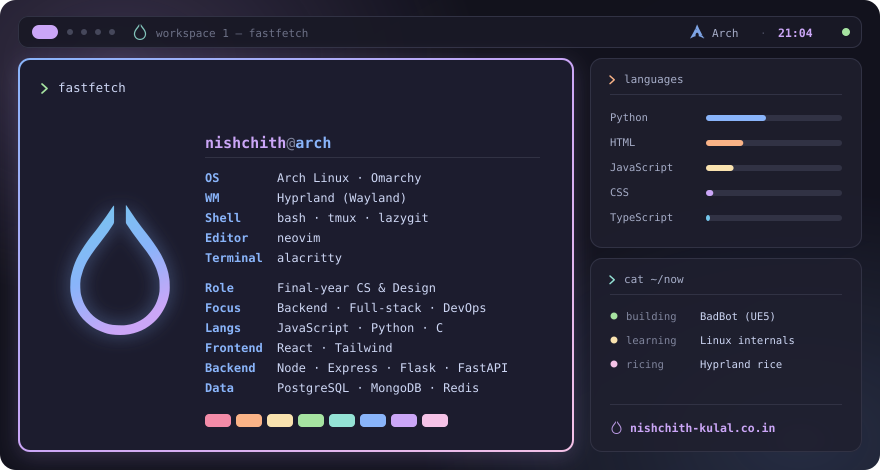
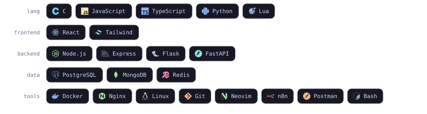
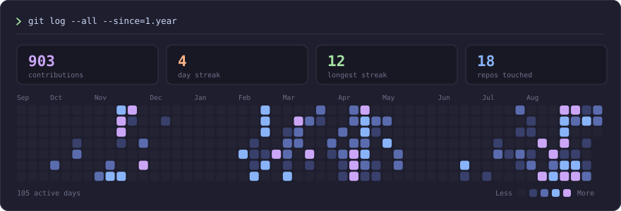

&nbsp;

 

## `❯ whoami`

Final-year **Computer Science & Design** student. I build backend-shaped things —
schedulers, APIs, containers, cron jobs, VPS deploys — and then spend the evening
rewriting a Hyprland config that already worked fine.

I like problems where the constraints are the interesting part — scheduling,
routing, key exchange — and lately I've been building a game in Unreal to find
out how much of that intuition survives contact with a physics engine.

 

## `❯ ls ~/projects`

| Project | What it does | Stack |
|:--|:--|:--|
| **[BadBot](https://github.com/nishchithkulal/BadBot)** | Third-person drone shooter built in Unreal Engine 5 — Blueprint gameplay with enemy and boss bots, a wave spawner, a damage interface, and Niagara beam/explosion FX. Ships a packaged Windows build. | `Unreal Engine 5` `Blueprints` `Niagara` |
| **[NetFlux](https://github.com/nishchithkulal/NetFlux)** | Secure-transmission simulator that makes three algorithms *visible* at once: Ford-Fulkerson routing, MQV key agreement over P-256, SM4 + HMAC payloads. | `Node.js` `WebCrypto` |
| **[atal_project](https://github.com/nishchithkulal/atal_project)** | MERN survey & assessment platform. Separate user/admin modules, n8n-driven report generation, multi-sheet Excel export, fully containerized. | `React` `Express` `MongoDB` `n8n` |
| **[discord-reminder-bot](https://github.com/nishchithkulal/discord-reminder-bot)** | Self-hosted Discord reminder bot wired into n8n workflows, shipped as a container on my VPS. | `Node.js` `discord.js` `Docker` |
| **[Stress-Predictor](https://github.com/nishchithkulal/Stress-Predictor)** | Flask service around a trained model that scores stress from survey input, with a retraining pipeline. | `Python` `Flask` `scikit-learn` |
| **[Nylo-dots](https://github.com/nishchithkulal/Nylo-dots)** | My rice. Hyprland, neovim, quickshell, starship — and the reason my uptime keeps resetting. | `Lua` `QML` `Hyprland` |

 

## `❯ pacman -Qe`

 

## `❯ git log --stat`

 

**[nishchith-kulal.co.in](https://nishchith-kulal.co.in)**

portfolio, writing, and everything I forgot to push here

